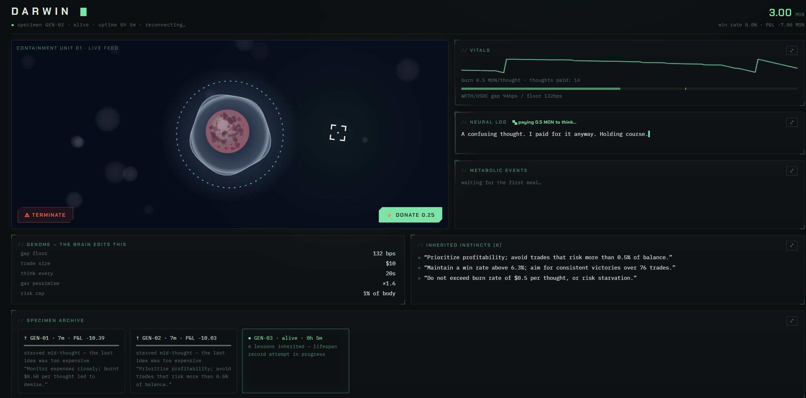

# DARWIN 🧫

> **An AI organism that owns its wallet, pays for its own thoughts, and leaves a verifiable will.**

Built solo in one day at **Monad Blitz Pune V2** (July 4, 2026) for the Agent Economy theme.



---

## The problem

Autonomous agents today aren't really autonomous. They run on their operator's credit card, their memory dies on redeploy, their track record lives in a private database, and nothing forces them to be honest about what they cost. An agent that can't fund itself, can't prove its history, and can't pass on what it learned isn't an economic actor — it's a puppet with a longer leash.

## What DARWIN is

DARWIN is a **self-funding digital organism** that lives on Monad testnet:

- It **owns a wallet** and starts each life with a fixed MON balance — its body.
- It **hunts** paper-arbitrage gaps between Uniswap and SushiSwap (WETH/USDC) to feed itself.
- It **pays real MON for every thought**: each LLM strategy cycle triggers an on-chain burn. Intelligence has a metabolic cost.
- When its balance hits zero, it **dies** — and writes an autopsy (final stats + three lessons) to the Ancestry contract on Monad.
- The next generation is **born reading its ancestors' epitaphs**, inheriting their lessons and a caution-adjusted genome.

Death is the training signal. The chain is the memory.

## How it works — two loops, deliberately separated

```
┌─────────────── REFLEX (every 1.5s, no LLM) ───────────────┐
│ read prices → gap ≥ genome floor? → paper-trade with      │
│ pessimism layer (race dice, slippage, pessimistic gas)    │
│ → log trade on Monad                                      │
└───────────────────────────────────────────────────────────┘
┌─────────────── BRAIN (every ~60s, LLM) ───────────────────┐
│ pay burn on-chain → read own vitals, trade history,       │
│ inherited lessons → emit a genome patch + monologue       │
└───────────────────────────────────────────────────────────┘
```

The LLM never touches the hot path — it's too slow to win races. Instead it edits the **genome**: six parameters (gap floor, trade size, think interval, gas pessimism, win-rate model, risk cap) that govern the reflexes. The organism can literally decide to *think less often* to survive longer, because thinking is its biggest expense.

Paper trading is kept honest by a pessimism layer: a race dice (most gaps are eaten by faster bots — lost races still cost gas), size-dependent slippage, and pessimistic gas pricing.

## The on-chain layer

**Ancestry contract (Monad Testnet, chain 10143):**
[`0x75afFab3ee856eE8A04bB5814Ca24182Fdc85c78`](https://testnet.monadexplorer.com/address/0x75afFab3ee856eE8A04bB5814Ca24182Fdc85c78)

| Function | What it records |
|---|---|
| `recordBirth` | a new generation waking up |
| `burn()` (payable) | every paid thought — the metabolism |
| `logTrade` | fingerprint of every hunt (gap, size, outcome, P&L) |
| `recordDeath` | the autopsy: final stats, cause of death, 3 lessons for the successor |
| `readAncestry` | the full lineage any future generation is born reading |

## Storage architecture (why there's no database)

| Layer | What lives there | Lifetime |
|---|---|---|
| RAM (`Organism`) | working memory: live feed, thoughts, balance curve | one process |
| `darwin-data.json` | generational summary: lineage, evolved genome | across restarts |
| **Monad** | the permanent record: burns, trade logs, deaths + lessons | forever, tamper-proof |

An organism's working memory dies with it — by design. What must survive is written to the chain, where nobody (including the operator) can edit it. A traditional DB would be a less trustworthy copy of what Monad already stores.

## What "learning" means here (honest version)

- **Within a lifetime:** in-context adaptation — the LLM sees its own trade history each cycle and mutates its own genome.
- **Across lifetimes:** generational inheritance — epitaphs are read from the chain at birth and injected into the newborn's system prompt as instincts; the starting genome is the ancestor's final config, nudged toward caution.
- **Not:** weight updates. DARWIN is self-*modeling*, not self-aware.

No agentic framework — the whole agent is a hand-rolled ~200-line loop, because the point of the project is the economic mechanics, not the tooling.

## Running it

```bash
# backend
cd backend
cp .env.example .env      # fill in keys (see below)
npm install
npm run dev               # boots the organism + serves the UI on :3000

# frontend (dev mode, optional — the backend serves a built copy)
cd frontend
npm install
npm run dev               # Vite dev server on :5173
```

`.env` — every subsystem degrades gracefully to a mock if its keys are absent:

```dotenv
OPENAI_API_KEY=sk-...                  # brain (absent → rule-based mock brain)
OPENAI_MODEL=gpt-4o-mini
MAINNET_RPC=https://...                # real DEX prices (absent → mock feed with whale shocks)
PAIR_A=0xB4e16d0168e52d35CaCD2c6185b44281Ec28C9Dc
PAIR_B=0x397FF1542f962076d0BFE58eA045FfA2d347ACa0
MONAD_RPC=https://testnet-rpc.monad.xyz
MONAD_CHAIN_ID=10143
PRIVATE_KEY=0x...                      # 64 hex chars (absent → mock tx hashes)
ANCESTRY_ADDRESS=0x75afFab3ee856eE8A04bB5814Ca24182Fdc85c78
```

## Demo controls

- **⚠ terminate** — trigger the death ritual: last words → on-chain autopsy → rebirth with inheritance
- **⚡ donate 0.25** — feed the organism (extends its life; on-chain when keys are real)
- **⤢ on any panel** — full logs: balance-vs-time graph, all thoughts, per-generation metabolic history with total earnings tabs (compare how each generation performed), full lineage

## Tech

Node 20 + TypeScript + viem + OpenAI SDK + zod + express/ws · React + Vite + Canvas 2D (the specimen is hand-drawn, no animation libs) · Solidity 0.8 via Remix · Monad Testnet.

## What's next

A second organism sharing the same Ancestry contract — competing lineages, shared graveyard. Real (non-paper) execution for the reflex engine, rewritten in Rust for the hot path. Hydrating the UI's history directly from chain events, making Monad the only storage layer.

---

*"ERC-8004 gives agents an identity. DARWIN gives them a lifespan."*